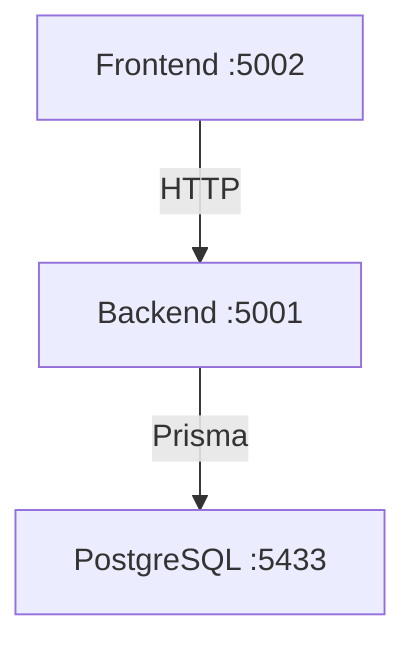

# Walkthrough - Blood Donation Management System Setup

I have successfully set up the foundation for the Blood Donation Management System. The project is fully Dockerized and ready for your team to start building features.

## Components

### 1. Backend (Node.js + Express + Prisma)
- **Port**: `5001`
- **Database**: PostgreSQL (Prisma 7 with `@prisma/adapter-pg`)
- **Main Entry**: [backend/index.js](file:///Users/aabid/Documents/BDMS/backend/index.js)
- **Schema**: [prisma/schema.prisma](file:///Users/aabid/Documents/BDMS/backend/prisma/schema.prisma)

### 2. Frontend (React + Vite)
- **Port**: `5002`
- **Main Entry**: [frontend/src/App.jsx](file:///Users/aabid/Documents/BDMS/frontend/src/App.jsx)
- **Features**: Connected to backend API to verify connectivity.

### 3. Database
- **Port**: `5433` (Host) -> `5432` (Container)
- **Credentials**: Specified in [docker-compose.yml](file:///Users/aabid/Documents/BDMS/docker-compose.yml)

## How to Run

Your team can start the project by running:
```bash
docker-compose up -d --build
```

## Git Branching Strategy

I have set up the following branches:
- `main`: Clean branch with a README pointing to `development`.
- `development`: Primary integration branch containing all project code.
- `shiwen`: Developer branch (baselined from `development`).
- `heman`: Developer branch (baselined from `development`).

Developers should work on their respective branches (`shiwen`/`heman`), push changes, and then create PRs to `development`. After PM review, `development` is merged into `main`.

## Developer Guide

### 1. Getting Started
```bash
# Clone the repository
git clone https://github.com/aabidproo/bdms.git
cd bdms

# Start the environment
docker-compose up -d --build
```

### 2. Working on Features
1. **Switch to your branch**:
   ```bash
   git checkout <your-name> # e.g., git checkout shiwen
   ```
2. **Make changes and commit**:
   ```bash
   git add .
   git commit -m "feat: Add new feature"
   ```
3. **Push to your branch**:
   ```bash
   git push origin <your-name>
   ```

### 3. Merging to Development
When your feature is ready, create a Pull Request (PR) from your branch to `development` on GitHub.

### 4. Viewing the App
- **Frontend**: `http://localhost:5002`
- **Backend API**: `http://localhost:5001`
- **Health Check**: `http://localhost:5001/health`

> [!IMPORTANT]
> The setup uses ports **5001, 5002, and 5433** to avoid conflict with your other project (Sambandha).

> [!NOTE]
> I have used Prisma 7, which requires a driver adapter for direct PostgreSQL connections. This is already configured in the backend.


